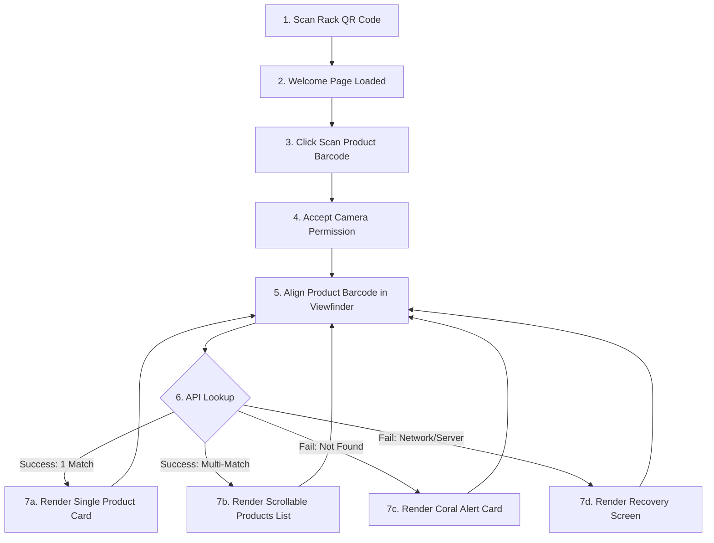

# 78 PriceCheck – Customer Experience Specification

This document defines the interface design, user journey, camera behavior, and accessibility standards for the customer-facing price verification client of **78 PriceCheck**.

---

## 1. Customer Journey



### Flow Breakdown:
1.  **Access**: Customer arrives at a store shelf, scans a printed QR code with their mobile device, and opens the application URL (`https://price.78supermaart.com/`).
2.  **Greeting**: The Customer Welcome page loads instantly, displaying store branding and a prominent CTA button: **"Scan Barcode"** set against a clean white-and-green aesthetic.
3.  **Activation**: The customer taps the button. If it's their first time, the browser prompts for camera permission. If permission fails, a Camera Recovery screen displays.
4.  **Scanning**: The viewport opens, occupying the top 40% of the screen. The customer holds a product barcode up to the camera.
5.  **Feedback**: Upon detection, the device emits a subtle beep/vibration feedback, a "Barcode Detected" notice flashes, and the system fetches the price.
6.  **Results**: The lower 60% card displays a **"Looking up price..."** loading state, then updates to show name, MRP, and Sale Price with a subtle highlight effect. The camera remains active so the user can immediately scan another item.

---

## 2. Screen Layouts (Split-Viewport Model)

The application enforces a rigid mobile-first vertical layout tailored for single-handed use:

```
+-----------------------------------+
|       78 PriceCheck Logo          |  <- Header (Thin, Minimal, No Info Button)
+-----------------------------------+
|                                   |
|       Camera Viewfinder Area      |  <- Upper 40% (Live Stream Viewport)
|        [Scanning Barcode...]      |
|                                   |
+-----------------------------------+
|                                   |
|      Dynamic Details Overlay      |  <- Lower 60% (Sliding Panel)
|                                   |
|      * Loading State Indicator    |
|      * Single Match Display       |
|      * Scrollable List Display    |
|      * Recovery / Error Panels    |
|                                   |
+-----------------------------------+
```

### Active UI Panels:
*   **Camera Viewport (`#camera-view`)**: Set to exactly `40vh`. Houses the `html5-qrcode` scan canvas with a center alignment overlay (target barcode frame).
*   **Result Card Panel (`#result-panel`)**: Occupies `60vh` and remains fixed. Uses a clean light background (`#f8f9fa`), pure white card surfaces (`#ffffff`), soft corners (`8px`), and light shadows.
    *   `#result-panel` visual highlight duration: approximately 300ms.
    *   *State A (Idle)*: Instructs the customer: *"Align product barcode in the box above to verify price."*
    *   *State B (Loading)*: Renders a clean progress spinner and message: *"Looking up price..."*
    *   *State C (Single Product)*: Renders the product name, a prominent Today's Price (Sale Price in bold green `#2e7d32`), and crossed-out MRP (`#6c757d`).
    *   *State D (Multiple Matches)*: Prompts: *"Multiple matching products found. Compare by MRP to identify the correct product."* followed by a list of cards sorted by price ascending, wrapped in a scrollable block.
    *   *State E (Not Found)*: Renders a warning card: *"Product not found. Please try scanning again or ask a store associate for assistance."*
    *   *State F (Automatic Error Recovery Screens)*:
        *   **Camera Permission Denied**:
            `Camera access is required to scan product barcodes.`
            `Please enable camera permission and try again.`
            `(Includes a Retry button)`
        *   **Camera Unavailable**:
            `Unable to access the camera.`
            `Please close other applications using the camera and try again.`
            `(Includes a Retry button)`
        *   **Network Error**:
            `Unable to connect.`
            `Please check your internet connection.`
            `(Includes a Retry button)`
        *   **Server Error**:
            `Price service is temporarily unavailable.`
            `Please try again shortly.`
            `(Includes a Retry button)`

---

## 3. Scanner & Camera Behavior

*   **Supported Symbologies**: Decodes standard EAN-13, EAN-8, UPC-A, and UPC-E codes.
*   **Continuous Active Stream**: The camera stream never shuts down on successful lookup. It remains active to support consecutive scanning.
*   **Smart Request Debouncing & Throttling**:
    *   When a barcode is decoded, the scanner pauses decoding loop for **2 seconds** ONLY if the barcode scanned is the same.
    *   If a *different* barcode is scanned, the lookup executes immediately without any debounce delay.
*   **Visual Highlights**: Applies a temporary subtle green outline/shadow pulse (approximately 300ms duration) to the result card whenever a new product is successfully rendered to draw the eye.
*   **Feedback Prompts**: Trigger browser-native vibration (`navigator.vibrate(80)`) and play a short high-frequency synthetic tone (`AudioContext` synthesizer) on success.

---

## 4. Mobile-First Interaction Rules

*   **One-Handed Ergonomics**: Keep the scanning toggle and interactive button elements inside the bottom 60% "thumb zone".
*   **Gesture Safeguards**: Disable browser pull-to-refresh (`overscroll-behavior-y: contain`) and double-tap zoom to prevent page resizing during scan alignment.
*   **Safe Area Padding**: Apply CSS margins referencing `env(safe-area-inset-bottom)` to accommodate physical notches and home bars on iOS and Android viewports.
*   **Responsive Breakpoints**: Set maximum container width to `480px` centered on desktop screens.

---

## 5. Performance Targets

*   **Bundle Size**: Zero framework overhead. Entire customer HTML, CSS, and JS footprint must not exceed **25KB** (excluding the scanning library).
*   **Load Time (FCP)**: Under **400ms** on 3G connections.
*   **Decode-to-Render Latency**: API roundtrip lookup under **150ms**.
*   **Smooth Layout Transitions**: 60fps card replacements using GPU-accelerated CSS properties.

---

## 6. Accessibility (a11y) & Usability

*   **Color Contrast**: Maintain a minimum contrast ratio of **4.5:1** for all text labels against white/grey background variants.
*   **Screen Readers**: Utilize `aria-live="polite"` on the results container to announce prices and product names automatically to visually impaired users.
*   **Readable Fonts**: Set a minimum font size of `16px` to avoid user-agent input zooming, and utilize heavy font weights for pricing values (`Today's Price: $10.00`).
*   **Clear Touch Targets**: Minimum button sizes of `48px` x `48px` with clear spacing bounds.
